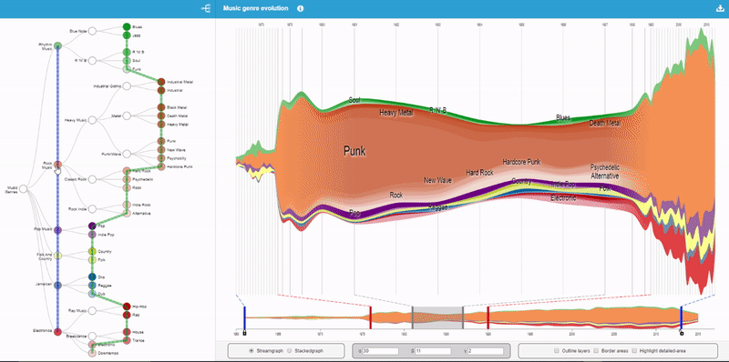

# MultiStream: A Multiresolution Streamgraph Approach to Explore Hierarchical Time Series
### A new approah to convey the hierarchical structure of multiple time series



## Resume

Multiple time series are a set of multiple quantitative variables occurring at the same interval. They are present in many domains such as medicine, finance, and manufacturing for analytical purposes. In recent years, streamgraph visualization (evolved from ThemeRiver) has been widely used for representing temporal evolution patterns in multiple time series. However, streamgraph as well as ThemeRiver suffer from scalability problems when dealing with several time series. To solve this problem, multiple time series can be organized into a hierarchical structure where individual time series are grouped hierarchically according to their proximity. In this paper, we present a new streamgraph-based approach to convey the hierarchical structure of multiple time series to facilitate the exploration and comparisons of temporal evolution. Based on a focus+context technique, our method allows time series exploration at different granularities (e. g., from overview to details).

## Keywords
Streamgraph, Stacked Graph, Time Series, Aggregation, Multiresolution Visualization, Overview+detail, Focus+context, Fisheye

**BibTex**
```
@article{cuenca2018multistream,
  title={Multistream: A Multiresolution Streamgraph Approach to Explore Hierarchical Time Series},
  author={Cuenca, Erick and Sallaberry, Arnaud and Wang, Florence Y and Poncelet, Pascal},
  journal={IEEE Transactions on Visualization and Computer Graphics},
  volume={24},
  number={12},
  pages={3160--3173},
  year={2018},
  publisher={IEEE}
}
```

## Links
[Website and datasets](http://advanse.lirmm.fr/multistream/) | [PDF](https://hal-lirmm.ccsd.cnrs.fr/lirmm-01693077v1 "PDF") | [Video](https://www.youtube.com/watch?v=T-Nrwif7dss "Video") | [Slides (presented at IEEE VIS 2018)](https://erickedu85.github.io/presentations/ecuenca_multistream_vis_2018.pdf "Slides (presented at IEEE VIS 2018)")

[Contact Us](mailto:erick.cuenca@lirmm.fr)

## Programming language
Javascript JS

## Getting the source code

**Requirements:**
* [Apache Web Server 2.4 or greater](https://httpd.apache.org/download.cgi)
* [PHP 7.2 or greater](https://www.php.net)

**Deployment:**

Go to the Apache Web root directory (e.g., /var/www/html/ in ubuntu):

    $ cd /var/www/html/

Clone this repository:
    
    $ git clone https://github.com/erickedu85/multistream/

Restart the Apache Web Server:

    $ sudo service apache2 restart

Open a browser (e.g., Google Chrome) and go to:

    http://localhost/multistream/index.php

## Replicate a functionality
Multistream is an interactive web application so users can perform several interactions. We cannot provide a script to replicate a specific functionality; however, we provide a step-by-step video to achieve the desired result.
* Following this [video](https://github.com/erickedu85/multistream/tree/master/replicability/video/multistream_replicability.mp4) you can replicate the result of Fig 17(C) of the [Multistream paper](https://doi.org/10.1109/TVCG.2018.2796591)


## Licence
[Attribution-NonCommercial-ShareAlike 4.0 International](https://creativecommons.org/licenses/by-nc-sa/4.0/ "Attribution-NonCommercial-ShareAlike 4.0 International")
